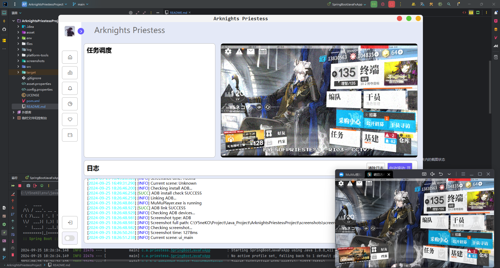

<h1 align="center">ArknightsPriestess</h1>

  明日方舟开源Java自动工具,名字取自<b>Eyes of Priestess - 女祭司之眼</b>(普瑞塞斯之眼)
    
  
  
    
  
  
    
  <a>———— 不准忘记我。</a>
   
  <a>———— Don't forget me.</a>
    
  
  

## AKP - ArknightsPriestess
正在开发中....

广泛向各位前端大佬征求前端设计!

## 开发界面

## 默认配置
`JDK 8u411`  |  `IDE Intellij 2024.2`  |  `语言等级 8`

## 架构
后端: SpringBoot

前端: JavaFx + WebView + HTML5

调度器: C++(暂定)

## 目录结构

`asset` 资产目录,包括用以识别的ui、按钮模板

`env` 内置运行环境(jdk8u411)

`files` 工具需要的重要文件

`log` 日志目录

`platform-tools` adb工具目录

`screenshots` 暂存adb截图文件,识别出错可以查看该文件夹内的截图状态

`asset.properties` 资产路径配置文件

`config.properties` 工具全局配置文件

## 版本&更新日志
**版本** v0.2

- *2022.04.30* | 发布了 v0.1 测试版本
- *2022.09.24* | 重新架构

## 贡献者

## 贡献者们

## 使用许可
[MIT](LICENSE) © Y5neKO

